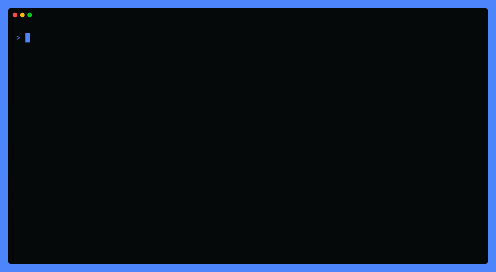

<p align="center">
  <a href="https://nika.sh">
    <picture>
      <source media="(prefers-color-scheme: dark)" srcset="media/hero-dark.svg">
      
    </picture>
  </a>
</p>

<p align="center">
  <a href="https://github.com/supernovae-st/nika-plugins/actions/workflows/gate.yml"></a>
  <a href="https://github.com/supernovae-st/nika/releases/latest"></a>
  <a href="LICENSE"></a>
  <a href="https://skills.sh/supernovae-st/nika-agents"></a>
</p>

<h1 align="center">One Add · your agent learns the language</h1>

<p align="center"><b>Teach your agent to hand repeatable work to
<a href="https://github.com/supernovae-st/nika">Nika</a>: a plain-text
workflow it can check before a token is spent and verify after.</b><br>
One Add installs the whole suite: 4 skills · 3 subagents · 6 slash commands
· 3 hooks · the read-only MCP oracle (9 tools: <code>nika_check</code> ·
<code>nika_explain</code> · <code>nika_schema</code> · <code>nika_examples</code> ·
<code>nika_template</code> · <code>nika_canon</code> · <code>nika_catalog</code> ·
<code>nika_tools</code> · <code>nika_inspect</code>).</p>


## Pick your door

The binary first, everywhere:

```sh
brew install supernovae-st/tap/nika          # macOS · Linuxbrew

# No brew, no sudo — installs to ~/.nika/bin, verifies the release
# checksum before extracting:
curl -LsSf https://nika.sh/install.sh | sh
```

Prefer to verify by hand? Every release publishes `SHA256SUMS` beside
its tarballs: download both from
[the release page](https://github.com/supernovae-st/nika/releases/latest),
run `shasum -a 256 -c SHA256SUMS`, then extract. ([every path](https://nika.sh))

Then one Add for your client:

<p align="center">
  <a href="#claude-code"></a>
  <a href="#codex"></a>
  <a href="#grok-build"></a>
  <a href="#openclaude"></a>
  <a href="#hermes-or-any-skillssh-client"></a>
  <a href="#cursor"></a>
  <a href="#everyone-else"></a>
</p>

<p align="center">
  <sub>or <a href="#every-client-you-have-one-command"><code>npx plugins add supernovae-st/nika-plugins</code></a> — every client on the machine, one command</sub>
</p>

### Claude Code

```sh
claude plugin marketplace add supernovae-st/nika-plugins
claude plugin install nika@nika
```

Updating is TWO rungs: marketplace first, plugin second, restart after.

### Codex

```sh
codex plugin marketplace add supernovae-st/nika-plugins
codex plugin add nika@nika
```

<sub>Codex takes the skills, commands, hooks and the oracle. It does
NOT take the 3 subagents or the 2 rules — its plugin schema has no key
for either, so they ship in the bundle and sit inert. Codex keeps one
cached copy per plugin version; it refreshes the next time you start
codex.</sub>

### Grok Build

```sh
grok plugin marketplace add supernovae-st/nika-plugins
grok plugin install nika@nika --trust
```

<sub>Reads the Claude Code kit natively; <code>--trust</code> activates hooks + MCP.</sub>

### OpenClaude

```sh
openclaude plugin marketplace add supernovae-st/nika-plugins
openclaude plugin install nika@nika
```

<sub>Its loader reads the same marketplace layout, unported.</sub>

### Hermes, or any skills.sh client

```sh
npx skills add supernovae-st/nika-plugins
```

<sub>The kit-native skill pack, e2e-proven and listed live on
<a href="https://skills.sh/supernovae-st/nika-agents">skills.sh</a>.</sub>

### Cursor

Search "nika" in Settings → Plugins, one Add installs the full bundle (a
manual drop into `~/.cursor/plugins/local/` loads MCP + skills ONLY).

Until the listing serves you, `nika init` equips the **repo**: the
`AGENTS.md` family, the authoring skill, the subagents, the rules, the
hooks and the MCP oracle. The remaining skills and the `/nika:*` commands
arrive with the plugin — they load from its manifest, which is the
client's own plugin system's job, not a file a repo can carry.

### Every client you have, one command

```sh
npx plugins add supernovae-st/nika-plugins
```

<sub>Vercel's installer detects which of Claude Code, Cursor, Codex, Grok
Build, Kimi Code, GitHub Copilot CLI and VS Code are on your machine and
installs to each through that client's own plugin system. Add
<code>-t &lt;client&gt;</code> for one of them, <code>--scope project</code> to keep
it in the repo. Run <code>npx plugins discover supernovae-st/nika-plugins</code>
first to see what it found before anything is written — measured
2026-08-07: <code>4 skills, 6 cmds, 3 agents, 2 rules, mcp</code>.</sub>

### Everyone else

opencode · Kimi Code · Gemini CLI · Zed · Cline · Copilot CLI · Amp · Warp ·
30+ clients: `nika init` equips the repo, `nika wire <client>` wires the
machine, and the read-only oracle rides any MCP client. Every door on one
page: [docs.nika.sh/integrations/everywhere](https://docs.nika.sh/integrations/everywhere).

### One-click doors

Where the client supports a one-click MCP install, one button wires the
read-only oracle — the oracle only: the full plugin still arrives through
your client's Add above (binary still required):

<p align="center">
  <a href="https://vscode.dev/redirect/mcp/install?name=nika&config=%7B%22command%22%3A%20%22nika%22%2C%20%22args%22%3A%20%5B%22mcp%22%5D%7D"></a>
  <a href="https://insiders.vscode.dev/redirect/mcp/install?name=nika&config=%7B%22command%22%3A%20%22nika%22%2C%20%22args%22%3A%20%5B%22mcp%22%5D%7D"></a>
  <a href="https://cursor.com/en/install-mcp?name=nika&config=eyJjb21tYW5kIjogIm5pa2EiLCAiYXJncyI6IFsibWNwIl19"></a>
</p>

## Your first minute

See a workflow work before anything else — offline, zero keys, nothing
written:

```sh
nika try 01-hello
```



## Your first real answer

`nika try` runs on a **mock** model: it proves the plumbing and echoes
your prompt back. Real work needs a real seat, and you have three —
pick one and re-run with `nika run <file>`:

```sh
# 1 · Local, no key, no daemon — the binary serves the model itself
nika model pull unsloth/Qwen3-4B-Instruct-2507-GGUF   # size prints before downloading
nika model serve --model unsloth/Qwen3-4B-Instruct-2507-GGUF

# 2 · Local, via ollama, if you already run it
ollama serve                                          # then: model: ollama/llama3.2

# 3 · A cloud provider — one key, in your shell
export OPENAI_API_KEY=…      # or ANTHROPIC_API_KEY · MISTRAL_API_KEY · GEMINI_API_KEY
```

`nika doctor` tells you which of the three this machine already has.
Any workflow runs on any of them: the seat is one line (`model:`) in
the file, or `--model <provider>/<name>` on the run.

Then paste one of these into your agent:

> Turn this repeatable task into a checked Nika workflow.

> Validate this .nika.yaml file and repair every finding.

> Diagnose this failed Nika run from its trace.

<p align="center">
  <picture>
    <source media="(prefers-color-scheme: dark)" srcset="media/loop-dark.svg">
    
  </picture>
</p>

The plugin proposes the command; you type it. Spend is capped at the call
that would cross the cap, the effect boundary is declared in the file and
reviewable in a diff, and every run leaves a hash-chained trace you can
verify afterwards. Running stays yours:


## Proven where you work

Coverage is a machine-checked contract, not a claims list:
[`clients.yaml`](clients.yaml) tracks 31 clients across 9 component classes
(CI-gated both ways against the shipped binary). The proven rows, each with
a deterministic receipt:

| Client | The receipt |
|---|---|
| **Claude Code** | full suite loads in-session: skills · subagents · `/nika:*` · hooks · oracle |
| **Codex** | marketplace page live (interface block · try-now prompts) · plugin cache enabled |
| **Grok Build** | `grok inspect --json` lists every component with origins · `grok mcp doctor --json`: handshake OK, 9 tools ([fiche](integrations/grok-build/)) |
| **Kimi Code** | a stream-json run emits `tool_calls: mcp__nika__nika_canon` · the oracle loaded AND called ([fiche](integrations/kimi-code/)) |
| **opencode** | `opencode mcp list` → `✓ nika connected` ([fiche](integrations/opencode/)) |
| **Hermes / skills.sh** | e2e-proven skill pack, listed live ([skills.sh](https://skills.sh/supernovae-st/nika-agents)) |
| **Any MCP client** | the containerized oracle answers `initialize` + `tools/list` on every CI run ([integrations/mcp](integrations/mcp/)) |

<sub>Listed across the ecosystem:
<a href="https://skills.sh/supernovae-st/nika-agents">skills.sh</a> ·
<a href="https://claudepluginhub.com">ClaudePluginHub</a> ·
<a href="https://github.com/davila7/claude-code-templates">aitmpl.com</a> ·
<a href="https://crates.io/crates/nika">crates.io</a> ·
<a href="https://github.com/SchemaStore/schemastore">SchemaStore</a> (<code>*.nika.yaml</code> in every IDE) ·
<a href="https://www.libhunt.com/r/nika">LibHunt</a> ·
<a href="https://archive.softwareheritage.org/browse/origin/?origin_url=https://github.com/supernovae-st/nika">Software Heritage</a>
· every submission lives in <a href="listings.yaml"><code>listings.yaml</code></a>, verified on a cadence.</sub>

## Keeping the suite fresh

The binary moved and a kit stayed behind? One command names it:

```sh
nika doctor    # reads what each client actually loads · names any kit
               # lagging the binary's train · prints the exact per-client fix
```

Every surface invokes the binary and the plugin kits ride its release train,
but no surface updates another: brew never touches a plugin, a marketplace
never touches the binary. The gestures, per surface:

<p align="center">
  <picture>
    <source media="(prefers-color-scheme: dark)" srcset="media/update-rungs-dark.svg">
    
  </picture>
</p>

| Surface | Update gesture |
|---|---|
| Binary | `brew upgrade nika` |
| Claude Code plugin | `claude plugin marketplace update nika` **then** `claude plugin update nika@nika` (two rungs · restart after) |
| Codex plugin | `codex plugin marketplace upgrade nika` |
| Cursor plugin | Settings → Plugins → nika (the listing serves the current train) |
| Every surface at once (maintainers) | `scripts/update-mirrors.sh` (`--check` reports drift read-only, CI-able) |

Drift is advisory (`nika doctor` warns · exit 0) and every fix line it
prints is copy-paste ready.

## Taking it back off

Same three mechanisms, in reverse. The plugin comes off with one
command per client; the machine wiring is **manual today** — `nika
wire` has no `--remove`, and this table is here so you do not have to
go looking.

| Surface | Removal gesture |
|---|---|
| Claude Code plugin | `claude plugin uninstall nika@nika` **then** `claude plugin marketplace remove nika` |
| Codex plugin | `codex plugin remove nika@nika` **then** `codex plugin marketplace remove nika` |
| Cursor plugin | Settings → Plugins → nika → Remove |
| One repo (`nika init`) | Delete what it wrote: `.cursor/`, `.agents/`, `.vscode/mcp.json`, `.mcp.json`, `AGENTS.md` — all tracked, so `git status` shows you the whole list before you decide |
| One machine (`nika wire`) | Delete the `nika` entry from the client's config (below), or the file if Nika created it |
| Binary | `brew uninstall nika`, or `rm -rf ~/.nika/bin` for the script install (models and traces live in `~/.nika/` too — remove the whole dir to take everything) |

`nika wire` only ever adds one `nika` server entry, and it names the
exact file before it writes: run `nika wire detected --dry-run` to see
your machine's list. The full set it can touch:

`~/.cursor/mcp.json` · `~/.claude.json` · `~/.codex/config.toml` ·
`~/.codeium/windsurf/mcp_config.json` ·
`~/Library/Application Support/Claude/claude_desktop_config.json` ·
`~/.cline/data/settings/cline_mcp_settings.json` ·
`~/.continue/mcpServers/nika.json` · `~/.config/zed/settings.json` ·
`~/.hermes/config.yaml` · `~/.gemini/settings.json` ·
`~/.gemini/config/mcp_config.json` · `~/.qwen/settings.json` ·
`~/.lmstudio/mcp.json` · `~/.grok/config.toml` ·
`~/.kimi-code/mcp.json` · `~/.kiro/settings/mcp.json` ·
`~/.copilot/mcp-config.json` — plus the project-local
`./.vscode/mcp.json`, `./opencode.json`, `./.junie/mcp/mcp.json`.

## How the pieces fit (the three layers)

<p align="center">
  <picture>
    <source media="(prefers-color-scheme: dark)" srcset="media/layers-dark.svg">
    
  </picture>
</p>

Three mechanisms, no overlap: the **plugin** teaches any agent the language
(per-agent) · **`nika init`** equips one repository (per-repo) · **`nika
wire`** configures one machine's clients (per-machine). The extension is not
a plugin: it is the full IDE surface, and on Cursor it nudges you to the
plugin for the agent side.

## Why a separate repo

`plugin marketplace add` clones its target. The engine repo carries the full
Rust workspace and media; this repo carries the plugin only, so the install
is instant. The files are mirrored verbatim from the engine's
[`.agents/plugins/`](https://github.com/supernovae-st/nika/tree/main/.agents/plugins).
File issues and PRs against [supernovae-st/nika](https://github.com/supernovae-st/nika).

<!-- city:map -->
## The city · where this repo sits

```
📜 nika-spec ──── the civil code · the law tables, the corpus, the exam
    │ sync-pack: byte-gated mirror        │ projectors: drift-gated
    ▼                                     ▼
⚙️ nika ───────── the engine + the catalog (the yellow pages)
    │ the release train                  🖥️ nika.sh · 📖 nika-docs
    ▼                                     the showroom · the manual
📦 homebrew-tap · npm · Docker ── the docks
🔌 nika-client · 🎨 nika-vscode · 🤖 nika-plugins · ⚡ gh-nika ── the doors   ◀── you are here
🏭 nika-action · 🧪 nika-actions-starter ── the CI district
🏪 nika-registry ── the market · 🏛 nika-estate ── the land registry
```

**This building** · THE AI KIT · agents learn the language here (the authoring skill · the MCP oracle · commands).

**Root** · neither · this building teaches the LANGUAGE. Its corpus is a sha256-pinned mirror of nika-spec and its commands are probed against the released engine · nothing authoritative is typed here.

**Consumes** · the engine's `.agents/plugins/` (mirrored byte-pinned · the heal follows the release train).

**Serves** · Claude Code · Codex · Cursor · Grok Build sessions, one Add each (OpenClaude rides the same layout).

**Truth lives** · everything here is a MIRROR · file issues and PRs against the engine.

All the buildings: [nika-spec](https://github.com/supernovae-st/nika-spec) · [nika](https://github.com/supernovae-st/nika) · [nika.sh](https://github.com/supernovae-st/nika.sh) · [nika-docs](https://github.com/supernovae-st/nika-docs) · [nika-client](https://github.com/supernovae-st/nika-client) · [nika-vscode](https://github.com/supernovae-st/nika-vscode) · [nika-plugins](https://github.com/supernovae-st/nika-plugins) · [gh-nika](https://github.com/supernovae-st/gh-nika) · [homebrew-tap](https://github.com/supernovae-st/homebrew-tap) · [nika-action](https://github.com/supernovae-st/nika-action) · [nika-actions-starter](https://github.com/supernovae-st/nika-actions-starter) · [nika-registry](https://github.com/supernovae-st/nika-registry) · [nika-estate](https://github.com/supernovae-st/nika-estate)

Every fact has one home · everything else is a gated projection.
The living map: [nika.sh/map](https://nika.sh/map).
<!-- /city:map -->

## What's inside

<p align="center">
  <picture>
    <source media="(prefers-color-scheme: dark)" srcset="media/suite-dark.svg">
    
  </picture>
</p>

```
.agents/plugins/marketplace.json      Codex marketplace manifest
.agents/plugins/nika/                 the plugin (the full suite, one bundle)
  .codex-plugin/plugin.json           Codex manifest
  .claude-plugin/plugin.json          Claude Code manifest
  .cursor-plugin/plugin.json          Cursor manifest (logo + all components)
  skills/{nika-authoring,nika-debugging,nika-operating,nika-migration}/
                                      author · run forensics · day-2 ops · script porting
  agents/{nika-author,nika-debugger,nika-migrator}.md
                                      the three subagents (write · root-cause · port)
  commands/{check,explain,new,trace,permits,doctor}.md
                                      the /nika:* slash commands
  hooks/{cursor,claude}-hooks.json    the three seatbelts, one file per dialect:
                                      session map · check-on-edit · guard-run (a nika
                                      run must pass nika check · the deny teaches)
  rules/nika-workflow-language.mdc    the language rule (the init template, verbatim)
  rules/nika-delegation.mdc           WHEN to propose a workflow, WHICH surface to use
  assets/nika-logo.png                the marketplace logo
  .mcp.json                           the read-only oracle wiring
.claude-plugin/marketplace.json       Claude Code marketplace manifest
.cursor-plugin/marketplace.json       Cursor marketplace manifest
clients.yaml                          the client × component matrix (the coverage SSOT)
skills/autonomous-ai-agents/nika/     the Hermes delegation skill (kit-native)
integrations/{grok-build,kimi-code,opencode,openclaude,mcp}/
                                      per-client fiches · live-verified, version-pinned
integrations/description-bank.md      the words every listing copies
listings.yaml                         the public submissions ledger
mirror.json                           the drift contract (classes + pins)
```

Two content classes, one contract (`mirror.json`): **engine-mirror** files
are byte-identical projections of the engine repo, pinned by sha256 at the
engine SHA they were proven against: a pin mismatch means corruption (hard
fail), upstream movement means a re-sync is due. **kit-native** files are
owned here and proven against the latest released binary instead: the gate
asserts every taught `nika <subcommand>` and every advertised `nika_*` tool
actually ships. The oracle is read-only by design:
[threat model](integrations/mcp/THREAT-MODEL.md).

## Add your client · ask for a workflow

You want to support Nika in your client? Copy the matching
[`integrations/`](integrations/) folder: each one is self-contained,
version-pinned, and gate-checked against the live binary. Missing a
workflow for your use case?
[Ask for one](https://github.com/supernovae-st/nika-plugins/issues/new?template=request-a-workflow.yml)
· the answer ships as a checked file, receipts included.

<p align="center">
  <sub>Start from a template: <a href="https://github.com/supernovae-st/nika-actions-starter">nika-actions-starter</a> (workflow + editor wiring + CI receipts)<br>
  Docs: <a href="https://docs.nika.sh">docs.nika.sh</a> · Engine (AGPL-3.0): <a href="https://github.com/supernovae-st/nika">nika</a> · 🦋 SuperNovae Studio · Paris</sub>
</p>
