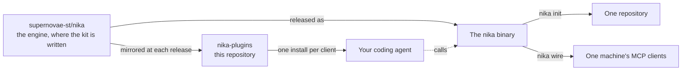

<p align="center">
  <a href="https://nika.sh">
    <picture>
      <source media="(prefers-color-scheme: dark)" srcset="https://nika.sh/brand/nika-logo-dark.svg">
      
    </picture>
  </a>
</p>

<h1 align="center">Nika for coding agents</h1>

<p align="center">
  <strong>Your coding agent turns the work you repeat into small workflow files: checked before a single token is spent, run when you ask, verifiable afterwards.</strong><br>
  One plugin, <code>nika@nika</code>, for Claude Code, Codex, Grok Build and Cursor · a skill for Hermes · a read-only server for any MCP client.
</p>

<p align="center">
  <a href=".claude-plugin/marketplace.json"></a>
  <a href="https://github.com/supernovae-st/nika-plugins/actions/workflows/gate.yml"></a>
  <a href="https://github.com/supernovae-st/nika/releases/latest"></a>
  <a href="https://docs.nika.sh"></a>
  <a href="LICENSE"></a>
  <br>
  <a href="https://scorecard.dev/viewer/?uri=github.com/supernovae-st/nika-plugins"></a>
  <a href="https://archive.softwareheritage.org/browse/origin/?origin_url=https://github.com/supernovae-st/nika-plugins"></a>
  <a href="https://skills.sh/supernovae-st/nika-plugins"></a>
</p>

<!-- Engine clips load from supernovae-st/nika at main (media/), where they are
     rendered from captured CLI output. They are not pinned to a release tag, so a
     clip can show a newer engine than the release this marketplace mirrors. -->
<p align="center">
  <a href="https://github.com/supernovae-st/nika/raw/refs/heads/main/media/videos/chat-to-workflow.mp4">
    
  </a>
  <br>
  <sub><i>If you ask it twice, keep it as a workflow.</i> The request you retype every Monday, kept as one checked file. Click to play the video.</sub>
</p>

## What is Nika?

Nika turns repeatable AI work into a small file you keep. Say what you
want done, like *"every Monday, pull the action items out of my meeting
notes"*, and Nika writes it as a readable `.nika` workflow. Before
anything runs, `nika check` shows what the workflow will do, which models
and tools it uses, what it is allowed to touch and what it can cost,
without calling a model. You run it when you decide, with the model you
choose, local or cloud, and every run leaves a tamper-evident record you
can verify. One Rust binary, local-first, open source (AGPL-3.0).

| 1 · Say it | 2 · Check it | 3 · Run it | 4 · Prove it |
|:---:|:---:|:---:|:---:|
| Describe the job; Nika writes a `.nika` file | `nika check` audits it before any model is called | `nika run` with the model you choose | `nika trace verify` checks the run's record |

> [!TIP]
> **This repository puts those four steps in your coding agent.** Add the
> plugin, and your agent writes the file, runs `nika check` and repairs what it
> finds, runs the workflow when you ask, and reads the run's record when
> something breaks. The `nika` binary does the work; the plugin, written in the
> [engine repository](https://github.com/supernovae-st/nika) and mirrored here
> at each release, teaches your agent to drive it.

## Start in two minutes

1. **Install `nika`**, the binary the plugin drives (macOS or Linux):

   ```sh
   brew install supernovae-st/tap/nika
   ```

   <sub>No Homebrew? <code>curl -LsSf https://nika.sh/install.sh | sh</code> · then <code>nika --version</code> confirms it.</sub>

2. **Add the plugin to your agent.** In Claude Code:

   ```sh
   claude plugin marketplace add supernovae-st/nika-plugins
   claude plugin install nika@nika
   ```

   Codex, Grok Build, Cursor, Hermes or another client? [Pick yours below](#install-in-your-client).

3. **Ask for a workflow.** Open a new session and say:

   > Turn this repeatable task into a checked Nika workflow.

No task in mind yet? `nika try 01-hello` runs a first workflow offline, with
no key, and leaves nothing behind.

> [!IMPORTANT]
> **Install the binary first, and make sure your editor can see it.** Where the
> plugin's hooks load, every shell command your agent runs passes through its
> run guard, and the guard blocks them all while it cannot find `nika` on the
> editor's `PATH`. On macOS, an editor opened from the Dock may not inherit your
> shell `PATH`: open it once from a terminal (for example `open -a Cursor`).

## What your agent can do

<!-- motion: a coding agent using the Nika plugin to write, check and run a workflow -->

<table>
  <tr>
    <td width="33%" valign="top">
      <b>Write the workflow</b><br>
      Describe a job you repeat. Your agent starts from a ready template and writes the <code>.nika</code> file.
    </td>
    <td width="33%" valign="top">
      <b>Check it before it costs anything</b><br>
      Every draft goes through <code>nika check</code>: what it will do, what it may touch, what it can cost. No model is called.
    </td>
    <td width="33%" valign="top">
      <b>Repair what the check finds</b><br>
      Each finding comes with a code and a fix. Your agent repairs the file and checks again until it is clean.
    </td>
  </tr>
  <tr>
    <td width="33%" valign="top">
      <b>Run it when you ask</b><br>
      The run goes through your agent's shell, under your client's usual permission rules. The guard refuses a file with open findings.
    </td>
    <td width="33%" valign="top">
      <b>Explain a failed run</b><br>
      Your agent reads the run's trace (its tamper-evident record), names the task that failed and hands you the command to pick up where it stopped.
    </td>
    <td width="33%" valign="top">
      <b>Port what you already have</b><br>
      Scripts, CI jobs and prompt chains become checked workflows, with a parity report against the original.
    </td>
  </tr>
</table>

Ask in plain words, or type a slash command:

| You ask | Your agent |
|---|---|
| *"Turn this repeatable task into a checked Nika workflow."* | writes the file from a template, then checks and repairs it until it is clean |
| *"Validate this .nika file and repair every finding."* | runs the audit, fixes each finding and checks again |
| *"Diagnose this failed Nika run from its trace."* | reads the run's record, then hands back the cause and the exact command to recover |
| `/nika:check` · `/nika:explain` · `/nika:compile` | audits a file · explains a workflow or an error code · starts a workflow from an exact skeleton |
| `/nika:trace` · `/nika:permits` · `/nika:doctor` | reads a run's record · writes the tightest `permits:` block · diagnoses this machine's setup |

**Watch each step.** Every command and every line of terminal output in these
clips is captured from the real CLI; click a poster to play its clip.

<table>
  <tr>
    <td width="50%" align="center" valign="top">
      <a href="https://github.com/supernovae-st/nika/raw/refs/heads/main/media/videos/static-check-fix.mp4"></a><br>
      <b>Checked before it runs</b><br>
      <sub><code>nika check</code> catches two defects; the fix passes a clean re-check</sub>
    </td>
    <td width="50%" align="center" valign="top">
      <a href="https://github.com/supernovae-st/nika/raw/refs/heads/main/media/videos/permits-audit.mp4"></a><br>
      <b>The file is the boundary</b><br>
      <sub>What a workflow may touch, drawn from its <code>permits:</code>; an escape is caught before anything runs</sub>
    </td>
  </tr>
  <tr>
    <td width="50%" align="center" valign="top">
      <a href="https://github.com/supernovae-st/nika/raw/refs/heads/main/media/videos/workflow-gallery.mp4"></a><br>
      <b>Start from a ready workflow</b><br>
      <sub>The jobs <code>nika try</code> lists, from meeting notes to release notes</sub>
    </td>
    <td width="50%" align="center" valign="top">
      <a href="https://github.com/supernovae-st/nika/raw/refs/heads/main/media/videos/full-loop.mp4"></a><br>
      <b>Compile, check, run, verify</b><br>
      <sub>The four commands, offline on a mock model, ending with the record verified</sub>
    </td>
  </tr>
</table>

## Install in your client

<p align="center">
  <a href="#claude-code"></a>
  <a href="#codex"></a>
  <a href="#grok-build"></a>
  <a href="#cursor"></a>
  <a href="#hermes-or-any-skillssh-client"></a>
  <a href="#everyone-else"></a>
</p>

Install the binary first ([step 1](#start-in-two-minutes)), then pick your
client. What each one loads from the plugin:

| Client | Skills | Subagents | Slash commands | Hooks | Oracle |
|---|:---:|:---:|:---:|:---:|:---:|
| [Claude Code](#claude-code) | ✓ | ✓ | ✓ | ✓ | ✓ |
| [Codex](#codex) | ✓ | · | ✓ | ✓ | ✓ |
| [Grok Build](#grok-build) | ✓ | ✓ | ✓ | ✓ | ✓ |
| [Cursor](#cursor) | ✓ | ✓ | ✓ | ✓ | ✓ |
| [Hermes and skills.sh clients](#hermes-or-any-skillssh-client) | the delegation skill | · | · | · | with `nika wire hermes` |
| [VS Code](#every-client-you-have-one-command) | ✓ | · | · | · | ✓ |
| [Any MCP client](#everyone-else) | · | · | · | · | ✓ |

<sub>The oracle is <code>nika mcp</code>: a read-only MCP server your agent asks to check and explain
workflows, with no tool that runs one. Cursor also loads the 2 rules (the language rule and the
delegation rule); its row is what its manifest declares, not yet checked live.</sub>

### Claude Code

```sh
claude plugin marketplace add supernovae-st/nika-plugins
claude plugin install nika@nika
```

It loads the 4 skills, 3 subagents, 6 slash commands, 3 hooks and the oracle.
Open a new session to use them.

### Codex

```sh
codex plugin marketplace add supernovae-st/nika-plugins
codex plugin add nika@nika
```

Codex loads the skills, the slash commands, the hooks and the oracle. Its
plugin format has no place for subagents or rules, so those stay in the
bundle, unused. Codex caches one copy per plugin version and loads a new one
the next time you start `codex`.

### Grok Build

```sh
grok plugin marketplace add supernovae-st/nika-plugins
grok plugin install nika@nika --trust
```

Grok Build reads the Claude Code layout as it is. `--trust` is required:
without it Grok refuses the install, and it is what turns on the hooks and
the oracle. How it was checked: [integrations/grok-build](integrations/grok-build/).

### Cursor

Cursor has the fullest manifest in the bundle: rules, skills, subagents, slash
commands, hooks and the oracle. This repository lists it for Cursor in
[`.cursor-plugin/marketplace.json`](.cursor-plugin/marketplace.json). Three
ways in:

- **Through its plugin system:** `npx plugins add supernovae-st/nika-plugins`
  ([below](#every-client-you-have-one-command)).
- **As a local copy:** copy `.agents/plugins/nika` from a checkout of this
  repository into `~/.cursor/plugins/local/nika`; `scripts/update-mirrors.sh`
  keeps it in sync. A local copy loads the skills and the oracle only.
- **The oracle alone:** `nika wire cursor`, or the one-click button
  [below](#one-click-the-oracle-only).

### Hermes, or any skills.sh client

```sh
npx skills add supernovae-st/nika-plugins
```

This installs the delegation skill, written for Hermes: it hands repeatable
work to Nika through the agent's terminal, from finding or writing the
`.nika` file to checking it and reading the run's evidence. It is listed on
[skills.sh](https://skills.sh/supernovae-st/nika-plugins). Hermes also takes
it with `hermes skills tap add supernovae-st/nika-plugins`, and
`nika wire hermes` adds the oracle.

### Every client you have, one command

```sh
npx plugins add supernovae-st/nika-plugins
```

Vercel's installer finds which of Claude Code, Cursor, Codex, Grok Build,
Kimi Code, GitHub Copilot CLI and VS Code are on your machine
(`npx plugins targets` lists them) and installs through each client's own
plugin system. Add `-t <client>` for just one, or `--scope project` to keep
it in the repository. VS Code reads only the portable part of the bundle,
the skills and the oracle, once its `chat.plugins.enabled` setting is on.

`npx plugins discover supernovae-st/nika-plugins` shows what it found before
anything is written. Replayed with `plugins@1.3.4` on 2026-09-10:

```
◇  Found 1 local plugin(s)
│
│  nika  4 skills, 6 cmds, 3 agents, 2 rules, mcp  Author, debug, operate and m…
```

### Everyone else

opencode, Kimi Code, Gemini CLI, Zed, Cline, Copilot CLI, Amp, Warp and the
rest of [`clients.yaml`](clients.yaml) get Nika in two moves: `nika init`
sets up the repository (agent guides, the authoring skill, rules, hooks,
oracle settings) and `nika wire` adds the read-only oracle to each client's
MCP settings:

```sh
nika wire detected --dry-run   # preview the clients this machine has, and the file each one gets
nika wire detected             # write them
```

<!-- motion: nika wire detected previewing, then wiring, the MCP clients a machine has -->

Every client on one page:
[docs.nika.sh/integrations/everywhere](https://docs.nika.sh/integrations/everywhere).
OpenClaude reads the Claude Code marketplace layout, according to its source;
its notes and their honest status are in [integrations/openclaude](integrations/openclaude/).

### One click: the oracle only

Where a client installs MCP servers in one click, a button adds the read-only
oracle. Only the oracle: the full plugin comes through your client's install
above, and the binary is still needed.

<p align="center">
  <a href="https://vscode.dev/redirect/mcp/install?name=nika&config=%7B%22command%22%3A%20%22nika%22%2C%20%22args%22%3A%20%5B%22mcp%22%5D%7D"></a>
  <a href="https://insiders.vscode.dev/redirect/mcp/install?name=nika&config=%7B%22command%22%3A%20%22nika%22%2C%20%22args%22%3A%20%5B%22mcp%22%5D%7D"></a>
  <a href="https://cursor.com/en/install-mcp?name=nika&config=eyJjb21tYW5kIjogIm5pa2EiLCAiYXJncyI6IFsibWNwIl19"></a>
</p>

## Try it, then run it for real

**See one run first**: offline, no key, nothing left behind.

```sh
nika try 01-hello
```

```
rehearsal: mock/echo answers by echoing the prompt — not a real answer · a real one: `--model <provider/model>` with its key, or `--access <seat>` (nika doctor lists them)
  🦋 nika · hello · 1 task
     permits ✓ declared boundary · default-deny

  ✔  greet  infer · mock/echo  0ms
```

`nika try` on its own lists the whole gallery: a step-by-step path through the
language, then ready-made jobs. Missing the one you need?
[Ask for it](https://github.com/supernovae-st/nika-plugins/issues/new?template=request-a-workflow.yml):
the answer ships as a checked file.

**Then pick a real model.** A mock model echoes your prompt: it proves the
plumbing, nothing more. A real answer needs a real model, and you have three
kinds:

```sh
# 1 · Local, no key: the binary serves the model itself
nika model pull unsloth/Qwen3-4B-Instruct-2507-GGUF   # prints the size before downloading
nika model serve --model unsloth/Qwen3-4B-Instruct-2507-GGUF

# 2 · Local, through Ollama, if you already run it
ollama serve                                          # then: model: ollama/qwen3.5:4b

# 3 · A cloud provider: one key in your shell
export MISTRAL_API_KEY=…      # or HF_TOKEN · OPENAI_API_KEY · XAI_API_KEY · ANTHROPIC_API_KEY
```

`nika doctor` shows which of these this machine already has. The model is one
line in the file (`model:`), or `--model <provider>/<name>` on the run, so the
same file runs on a local model or on any provider in the engine's catalog.
<kbd>Ctrl</kbd>+<kbd>C</kbd> stops `nika model serve`.

> [!NOTE]
> **Cap the spend.** `nika run <file> --max-cost-usd 0.50` refuses to start when
> the audit's cost floor is already above the cap. During the run, once metered
> spend crosses it, nothing new starts; calls already running finish and count.
> A local or mock model is never blocked: it is unpriced, never free.

<details>
<summary><b>Write the smallest workflow yourself, and ask the oracle about it</b></summary>

<br>

Save this as `hello.nika`. The `mock/echo` model rehearses with no key and no
network:

```yaml
nika: hello
model: mock/echo
permits: {}
tasks:
  greeting:
    infer:
      prompt: "Say hello from the Nika plugin."
      max_tokens: 32
outputs:
  greeting: ${{ tasks.greeting.output }}
```

`nika check hello.nika` audits it; the last two lines of its report:

```
 ✔ audited · 1 task · 1 wave · permits {} · est out ≤$0.0000 · 0 hints · risk low
 layers · valid ✔ · access ready ✔ · capacity fit ✔ · run ready ✔
```

Your agent asks the same question through the oracle's `nika_check` tool. The
same call by hand, over stdio, with `jq` unwrapping the answer:

```sh
printf '%s\n' \
  '{"jsonrpc":"2.0","id":1,"method":"initialize","params":{"protocolVersion":"2025-06-18","capabilities":{},"clientInfo":{"name":"probe","version":"1"}}}' \
  '{"jsonrpc":"2.0","method":"notifications/initialized"}' \
  '{"jsonrpc":"2.0","id":2,"method":"tools/call","params":{"name":"nika_check","arguments":{"workflow":"nika: hello\nmodel: mock/echo\npermits: {}\ntasks:\n  greeting:\n    infer:\n      prompt: \"Say hello from the Nika plugin.\"\n      max_tokens: 32\noutputs:\n  greeting: ${{ tasks.greeting.output }}\n"}}}' \
  | nika mcp | jq -r 'select(.id == 2) | .result.content[0].text'
```

```
✔ clean — audited before a single token was spent · risk low
  1 task(s) · 1 wave(s) · permits {} · est out ≤$0.0000 ·          0 source(s) → 0 destination(s) · 1 model endpoint(s) · data internal
```

</details>

## What's in the plugin

> [!NOTE]
> **Nothing runs when you install it.** The plugin is instructions and
> settings; the oracle it adds is read-only, with no tool that runs a workflow.
> What a marketplace installs is the engine's own kit, copied byte for byte and
> pinned by checksum; the Hermes skill written here is checked in CI against
> the released binary.

<p align="center">
  <picture>
    <source media="(prefers-color-scheme: dark)" srcset="media/suite-dark.svg">
    
  </picture>
</p>

| Part | Name | What it does for your agent |
|---|---|---|
| **4 skills** | `nika-authoring` | writes, checks and repairs `.nika` files, loading only the language and validation references the task needs |
| | `nika-debugging` | works out what happened in a failed, paused or suspicious run, from its trace |
| | `nika-operating` | readies a working workflow to run unattended: spend caps, permits, secrets, model changes, CI, trace export |
| | `nika-migration` | turns existing scripts, CI jobs or prompt chains into workflows that behave the same |
| **3 subagents** | `nika-author` | writes or repairs one workflow and returns it with its actual check result; it never starts the run |
| | `nika-debugger` | separates the proven cause of a failed or paused run from guesses and hands back the recovery command; it never reruns anything |
| | `nika-migrator` | ports existing automation to a checked workflow, with a parity report |
| **6 slash commands** | `/nika:check` · `/nika:explain` · `/nika:compile` | audit a file · explain a workflow or an error code · start a workflow from an exact skeleton, or make a small edit |
| | `/nika:trace` · `/nika:permits` · `/nika:doctor` | read a run's record · write the tightest `permits:` block · diagnose this machine's Nika setup |
| **3 hooks** | session context | in a workspace that uses Nika, each session starts with the map (tools, rules, where runs are recorded) and a warning if `nika` is missing or out of step |
| | check on edit | audits every edit to a `.nika` file at once; the findings reach the agent (in Cursor, the hook log) and the edit is never blocked |
| | run guard | a `nika run` has to pass `nika check` first; a refusal carries the findings, so the agent repairs and checks again |
| **2 rules** (Cursor) | language · delegation | the four verbs (`infer` · `exec` · `invoke` · `agent`) on `*.nika` files · when to propose a workflow, and which skill to use |
| **The oracle** | `nika mcp` | `nika_check` · `nika_inspect` · `nika_explain` · `nika_schema` · `nika_examples` · `nika_template` · `nika_canon` · `nika_catalog` · `nika_tools`, read-only by design ([threat model](integrations/mcp/THREAT-MODEL.md)) |

The bundle's own README, mirrored from the engine, goes deeper on the hooks
(the comfort hooks stay quiet when something is missing; the run guard fails
visibly) and on Windows and macOS `PATH` details:
[.agents/plugins/nika/README.md](.agents/plugins/nika/README.md).

## Proven where you work

Which client loads which part is a checked record, not a promise:
[`clients.yaml`](clients.yaml) lists every client and how each part reaches
it, and CI checks it in both directions against the released binary. The
clients proven live, each with its receipt (the versions used are recorded in
that file):

| Client | Receipt |
|---|---|
| **Claude Code** | the whole suite loads in a session: skills · subagents · `/nika:*` commands · hooks · the oracle |
| **Codex** | a live install (plugin cache enabled) · the marketplace page shows the plugin's card |
| **Grok Build** | `grok inspect --json` lists every part with its origin · `grok mcp doctor --json` reports the handshake OK ([details](integrations/grok-build/)) |
| **Kimi Code** | a stream-json run calls `mcp__nika__nika_canon`: the oracle loaded and answered ([details](integrations/kimi-code/)) |
| **opencode** | `opencode mcp list` answers `✓ nika connected` ([details](integrations/opencode/)) |
| **Copilot CLI** | `copilot mcp get nika` answers · a headless `copilot -p` run calls the oracle |
| **Hermes · skills.sh** | the skill is listed live on [skills.sh](https://skills.sh/supernovae-st/nika-plugins) |
| **Any MCP client** | the oracle, built into a container, answers `initialize` and `tools/list` on every CI run ([integrations/mcp](integrations/mcp/)) |

<sub>Also listed on
<a href="https://claudepluginhub.com">ClaudePluginHub</a> ·
<a href="https://github.com/davila7/claude-code-templates">aitmpl.com</a> ·
<a href="https://github.com/SchemaStore/schemastore">SchemaStore</a> (YAML catalog; a <code>*.nika</code> fileMatch follow-up is still owed) ·
<a href="https://www.libhunt.com/r/nika">LibHunt</a> ·
<a href="https://archive.softwareheritage.org/browse/origin/?origin_url=https://github.com/supernovae-st/nika">Software Heritage</a>.
Every submission is recorded in <a href="listings.yaml"><code>listings.yaml</code></a> and checked on a schedule.</sub>

## Update or remove

### Keep it up to date

The binary moved and a plugin stayed behind? `nika doctor` reads the version
each client actually loads, names any plugin that lags the binary and prints
the fix for each one. Replayed on a machine whose Cursor copy and Claude Code
install lag 0.121.0:

```sh
nika doctor --plain | grep -A1 '^! kit'
```

```
! kit        cursor plugin kit 0.110.0 lags the binary (0.121.0)
  fix: re-sync the local drop: scripts/update-mirrors.sh (nika-plugins checkout)
! kit        claude plugin kit 0.116.2 lags the binary (0.121.0)
  fix: claude plugin marketplace update nika, then claude plugin update nika@nika
```

Nothing updates anything else: Homebrew never touches a plugin, and a
marketplace never touches the binary. One move per piece:

<p align="center">
  <picture>
    <source media="(prefers-color-scheme: dark)" srcset="media/update-rungs-dark.svg">
    
  </picture>
</p>

| What | How to update |
|---|---|
| The binary | `brew upgrade nika` |
| Claude Code plugin | `claude plugin marketplace update nika`, **then** `claude plugin update nika@nika`, then restart |
| Codex plugin | `codex plugin marketplace upgrade nika` (the next `codex` start loads it) |
| Cursor local copy | `scripts/update-mirrors.sh`, from a checkout of this repository |
| Everything at once (maintainers) | `scripts/update-mirrors.sh`; `--check` only reports drift, and exits 1 on any |

A lagging plugin is only a warning: `nika doctor` still exits 0, and every fix
line it prints is ready to paste.

### Take it back off

The plugin comes off with your client's own commands. `nika wire` has no
`--remove`, so the machine wiring comes off by hand; the table spells out
every piece.

| What | How to remove |
|---|---|
| Claude Code plugin | `claude plugin uninstall nika@nika`, **then** `claude plugin marketplace remove nika` |
| Codex plugin | `codex plugin remove nika@nika`, **then** `codex plugin marketplace remove nika` |
| Grok Build plugin | `grok plugin uninstall nika`, **then** `grok plugin marketplace remove nika` |
| Cursor local copy | delete `~/.cursor/plugins/local/nika` |
| One repository (`nika init`) | delete the files it created: it prints each one as it writes it, and `git status` lists them before you decide. Where the repository already had a `.gitignore`, remove only the `.nika/traces/` entry and the comment it added |
| One machine (`nika wire`) | delete the `nika` entry from that client's settings file (listed below), or the file itself if Nika created it |
| The binary | `brew uninstall nika`, or `rm ~/.nika/bin/nika` for the script install. `~/.nika/` also keeps pulled models and your run-signing keys: delete it only if you want those gone too. Run traces stay in each project's `.nika/traces/` |

<details>
<summary><b>Where <code>nika wire</code> writes, client by client</b></summary>

<br>

`nika wire` only ever adds one `nika` server entry, and it names the file
before it writes: `nika wire detected --dry-run` previews the clients this
machine shows, `nika wire all --dry-run` every supported one. Where each
client keeps it (`~` is your home folder, the workspace is `--dir`, by default
the current folder):

| `nika wire …` | Client | File that gets the `nika` entry |
|---|---|---|
| `cursor` | Cursor | `~/.cursor/mcp.json` |
| `vscode` | VS Code | `.vscode/mcp.json` in the workspace |
| `windsurf` | Windsurf | `~/.codeium/windsurf/mcp_config.json` |
| `claude` | Claude Code | `~/.claude.json` |
| `claude-desktop` | Claude Desktop | `~/Library/Application Support/Claude/claude_desktop_config.json` on macOS, `~/.config/Claude/claude_desktop_config.json` on Linux |
| `cline` | Cline | `~/.cline/data/settings/cline_mcp_settings.json` |
| `codex` | Codex | `~/.codex/config.toml` |
| `continue` | Continue | `~/.continue/mcpServers/nika.json` (reload Continue to pick it up) |
| `zed` | Zed | `~/.config/zed/settings.json` |
| `opencode` | opencode | `opencode.json` in the workspace |
| `hermes` | Hermes | `~/.hermes/config.yaml` |
| `gemini` | Gemini CLI | `~/.gemini/settings.json` |
| `qwen` | Qwen Code | `~/.qwen/settings.json` |
| `lmstudio` | LM Studio | `~/.lmstudio/mcp.json` |
| `junie` | JetBrains Junie | `.junie/mcp/mcp.json` in the workspace |
| `grok` | Grok Build | `~/.grok/config.toml` |
| `antigravity` | Antigravity | `~/.gemini/config/mcp_config.json` |
| `kimi` | Kimi Code | `~/.kimi-code/mcp.json` |
| `kiro` | Kiro | `~/.kiro/settings/mcp.json` |
| `copilot` | GitHub Copilot CLI | `~/.copilot/mcp-config.json` |
| `amp` | Amp | `~/.config/amp/settings.json` |

</details>

## How it fits together


```mermaid
flowchart LR
    engine["supernovae-st/nika<br/>the engine, where the kit is written"]
    plugins["nika-plugins<br/>this repository"]
    agent["Your coding agent"]
    binary["The nika binary"]
    repo["One repository"]
    machine["One machine's MCP clients"]
    engine -->|mirrored at each release| plugins
    plugins -->|one install per client| agent
    engine -->|released as| binary
    agent -. calls .-> binary
    binary -->|nika init| repo
    binary -->|nika wire| machine
```

Three mechanisms, each with its own scope:

| Mechanism | Covers | What it sets up |
|---|---|---|
| The plugin (this repository) | one agent | skills, subagents, slash commands, hooks and the oracle, through the client's own plugin system |
| `nika init` | one repository | agent guides (`AGENTS.md`, `CLAUDE.md` and friends), the authoring skill, rules, hooks and oracle settings, written into the repository |
| `nika wire <client>` | one machine | the read-only oracle, added to that client's MCP settings |

The [VS Code extension](https://github.com/supernovae-st/nika-vscode) is not a
plugin: it is the editor experience, and on Cursor it points you to this
plugin for the agent side.

**Why a separate repository?** `plugin marketplace add` clones its target. The
engine repository carries the whole Rust workspace and its media; this one
carries only the plugin, so the install is quick. The bundle is copied
verbatim from the engine's
[`.agents/plugins/`](https://github.com/supernovae-st/nika/tree/main/.agents/plugins)
at the release named in [`mirror.json`](mirror.json). A fix to a mirrored skill
lands in the engine repository and reaches this marketplace with the next
release; the daily `release-heal` workflow opens that re-sync pull request.

## For maintainers and client authors

<details>
<summary><b>What's in this repository</b></summary>

<br>

```
.claude-plugin/marketplace.json       Claude Code marketplace manifest
.cursor-plugin/marketplace.json       Cursor marketplace manifest
.agents/plugins/marketplace.json      Codex marketplace manifest
.agents/plugins/nika/                 the plugin: one bundle for every client, mirrored from the engine
  plugin.json · mcp.json              the portable Agent Plugins manifest and its MCP settings
  .claude-plugin/plugin.json          Claude Code manifest (hooks wired)
  .codex-plugin/plugin.json           Codex manifest (its marketplace card and starter prompts)
  .cursor-plugin/plugin.json          Cursor manifest (rules · skills · agents · commands · hooks · MCP)
  .mcp.json                           the read-only oracle: nika mcp
  skills/                             nika-authoring (with references/) · nika-debugging · nika-operating · nika-migration
  agents/                             nika-author · nika-debugger · nika-migrator
  commands/                           check · compile · doctor · explain · permits · trace
  hooks/                              claude-hooks.json · cursor-hooks.json: session context · check on edit · run guard
  scripts/                            the hook scripts and their tests
  rules/                              nika-workflow-language.mdc · nika-delegation.mdc
  assets/ · README.md · CHANGELOG.md
skills/autonomous-ai-agents/nika/     the Hermes delegation skill (owned here)
integrations/                         client packs: grok-build · kimi-code · opencode · openclaude · mcp, and the aur package recipe
integrations/description-bank.md      the words every listing copies
clients.yaml                          which client loads which part, and how (checked in CI)
listings.yaml                         every public listing and submission
mirror.json                           the mirror contract: file classes and sha256 pins
media/                                the animated diagrams and terminal recordings
scripts/                              the gates · resync-mirror.py · update-mirrors.sh · media/ tapes
assets/nika-logo.png                  the marketplace logo, a pinned copy of the kit's
```

</details>

<details>
<summary><b>Two kinds of files: mirrored, and owned here</b></summary>

<br>

[`mirror.json`](mirror.json) sorts every file into one of two classes.

- **Mirrored** files are byte-identical copies of the engine repository at the
  released tag named in `engine_ref`, each pinned by sha256. A file that
  differs from its pin is corruption, and CI fails hard; a newer engine
  release means a re-sync is due, a warning on pull requests and a failure on
  the daily run. Fix their wording in the engine, never here.
- **Owned here** files (the Hermes skill, the `integrations/` packs) are
  proven against the released binary instead: CI asserts that every `nika`
  subcommand they teach and every `nika_*` tool they name actually ships.

</details>

<details>
<summary><b>The gates CI runs, replayed by hand</b></summary>

<br>

```sh
claude plugin validate .                          # the marketplace manifest
claude plugin validate .agents/plugins/nika       # the plugin manifest
NIKA_BIN=/absolute/path/to/nika python3 scripts/check-mcp-tools.py
NIKA_BIN=/absolute/path/to/nika python3 scripts/check-skill-commands.py
NIKA_BIN=/absolute/path/to/nika python3 scripts/check-clients-matrix.py
NIKA_BIN=/absolute/path/to/nika python3 scripts/check-dead-forms.py
python3 scripts/check-vocab.py
```

The five gate scripts, replayed against a 0.121.0 build:

```
✓ README ⟺ nika mcp agree · 9 tools: nika_canon · nika_catalog · nika_check · nika_examples · nika_explain · nika_inspect · nika_schema · nika_template · nika_tools
✓ skills/autonomous-ai-agents/nika/SKILL.md · 9 taught subcommands ship; no known retired argv: catalog · check · compile · doctor · explain · mcp · run · test · trace
✓ the client matrix holds (schema · manifests · counts · wire)
✓ no dead language forms across 32 kit-native teaching files
✓ vocabulary law holds across 44 tracked .md files
```

The pins, the versions and upstream drift are judged in
[`gate.yml`](.github/workflows/gate.yml), and the oracle is built into a
container from the release artifacts and probed there on every run.

</details>

**Adding Nika to your client?** Copy the matching
[`integrations/`](integrations/) folder: each one is self-contained, pinned to
the versions it was checked with, and gated against the released binary.

<!-- city:map -->
## 🦋 The Nika family

| | Repository | What it gives you |
|---|---|---|
| 🦋 | [nika](https://github.com/supernovae-st/nika) | The engine and CLI: write, check, run and verify AI workflows |
| 📖 | [nika-docs](https://github.com/supernovae-st/nika-docs) | The documentation, live at [docs.nika.sh](https://docs.nika.sh) |
| 📜 | [nika-spec](https://github.com/supernovae-st/nika-spec) | The language specification and the suite that proves an engine follows it |
| 🧩 | [nika-vscode](https://github.com/supernovae-st/nika-vscode) | The editor extension: your workflow as a live graph, errors as you type |
| 🟦 | [nika-client](https://github.com/supernovae-st/nika-client) | Run and verify workflows from TypeScript |
| ✅ | [nika-action](https://github.com/supernovae-st/nika-action) | A GitHub Action that posts a `nika check` verdict on your pull requests |
| 🚀 | [nika-actions-starter](https://github.com/supernovae-st/nika-actions-starter) | A ready template: workflows, editor setup and CI from the first push |
| 📦 | [nika-registry](https://github.com/supernovae-st/nika-registry) | Shareable workflows, pinned and re-verified |
| 🤖 | **[nika-plugins](https://github.com/supernovae-st/nika-plugins)** | **Teaches your coding agent (Claude Code, Codex, Cursor…) to write Nika** |
| 🍺 | [homebrew-tap](https://github.com/supernovae-st/homebrew-tap) | `brew install supernovae-st/tap/nika` |
| 🐙 | [gh-nika](https://github.com/supernovae-st/gh-nika) | The Nika CLI as a GitHub CLI extension |
| 🏛️ | [nika-estate](https://github.com/supernovae-st/nika-estate) | Where each file in Nika's core repositories comes from, declared and re-checkable |
<!-- /city:map -->

This repository mirrors the engine's kit and carries the wiring for each
client. The language itself is defined by the specification and the engine,
not here.

## License

The mirrored plugin bundle carries the engine's license,
[AGPL-3.0-or-later](LICENSE). Most files written here, such as the client notes
and the gate scripts, carry an `SPDX-License-Identifier: Apache-2.0` header,
and the two agent skills written here (for Hermes and OpenClaude) are MIT, as
their frontmatter says.

## Security

Report a vulnerability privately through
[GitHub security advisories](https://github.com/supernovae-st/nika-plugins/security/advisories/new).
[SECURITY.md](SECURITY.md) explains the posture: nothing here runs on install,
the mirror is pinned by checksum, and the oracle is read-only.

## Contributing

Mirrored files are fixed in the engine: open issues and pull requests on
[supernovae-st/nika](https://github.com/supernovae-st/nika)
([CONTRIBUTING.md](https://github.com/supernovae-st/nika/blob/main/CONTRIBUTING.md)).
Files owned here (`clients.yaml`, `integrations/`, `skills/`, `scripts/`,
`media/`, this README) take pull requests here; [AGENTS.md](AGENTS.md)
explains which is which. The documentation lives at
[docs.nika.sh](https://docs.nika.sh).
